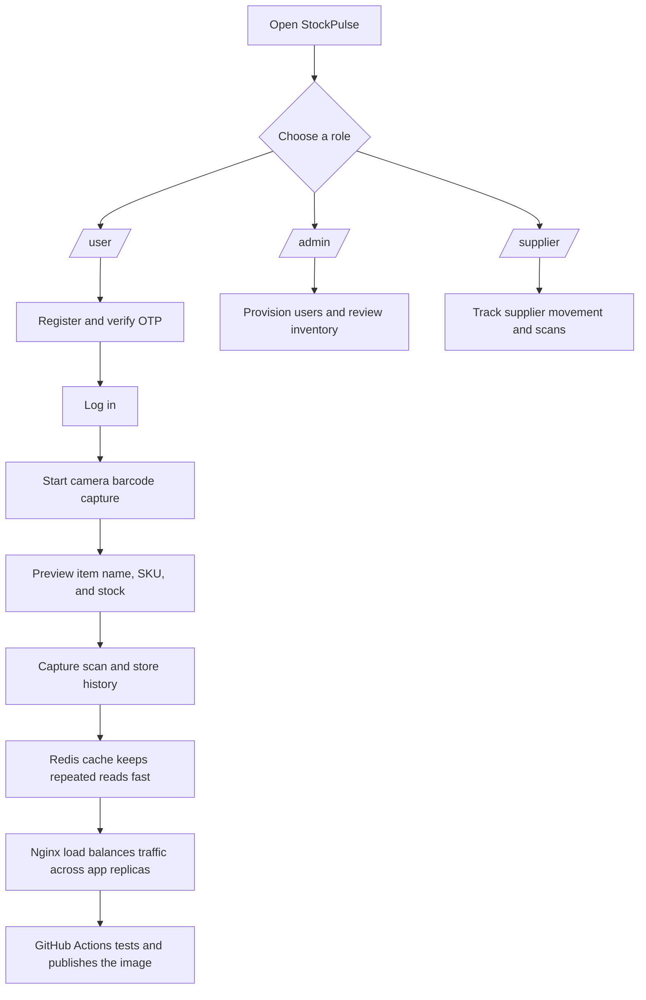

# StockPulse

[](https://github.com/osman-builds/StockPulse/actions/workflows/ci-cd.yml)
[](https://osman-builds.github.io/StockPulse/)

StockPulse is a FastAPI inventory and barcode-scanning app with role-based portals, PostgreSQL, Redis caching, Docker, and GitHub Actions for automated testing and image publishing. 

An interactive frontend showcase with live camera barcode scanning is hosted on [GitHub Pages](https://osman-builds.github.io/StockPulse/).

## Customer Problem

Retail and warehouse teams need a system that can:

- identify items quickly from a barcode or SKU,
- show the item name and stock status immediately,
- stay responsive when traffic increases,
- keep running even if one app instance fails,
- and publish a container image automatically after passing tests.

This app was built to solve those problems in a way that is easy to run locally and easy to deploy from GitHub.

## Why These Pieces Exist

- **Premium Standalone `/login` Screen:** Decoupled authentication layout with radial gradients, responsive mobile transitions, and user-role routing.
- **Sandbox OTP Mode:** Instantly shows validation OTP codes on the UI if SMTP configuration is absent, avoiding external dependency delays.
- **Real-Time Camera Scan:** Captures barcodes directly using the device camera stream on user/supplier portals.
- **Live Analysis Preview Card:** Fetches inventory metrics (safety stock, stock status, category) dynamically on entering or scanning codes.
- **Automatic Sandbox Seeding:** Seeds mock accounts and products automatically on launch for instant out-of-the-box evaluations.
- **Redis Cache:** Keeps repeated inventory reads fast and limits database lookups.
- **Nginx Load Balancer:** Balance traffic across multiple app replicas to maintain high availability.
- **GitHub Actions:** Validates builds and tests on pushes and pull requests.

## How The System Works



## Visual Tour

| Surface | What It Shows | Why It Matters |
| --- | --- | --- |
| Landing page | Role entry points and QA access | Keeps first-time users on the correct path |
| User portal | Register, OTP verify, scan capture | Guides the core operational flow |
| Admin portal | Provisioning and inventory management | Keeps control actions separate from public flows |
| Supplier page | Supplier-only movement and scans | Preserves role-based visibility |
| QA dashboard | Product health and usability checks | Gives a fast read on release quality |

## What Is In The Repo

The main app lives in [StockPulse](StockPulse/). Important files:

- [StockPulse/app.py](StockPulse/app.py) for the FastAPI app and UI pages.
- [StockPulse/docker-compose.yml](StockPulse/docker-compose.yml) for the multi-service deployment stack.
- [StockPulse/nginx.conf](StockPulse/nginx.conf) for the load balancer.
- [.github/workflows/ci-cd.yml](.github/workflows/ci-cd.yml) for the active GitHub Actions pipeline.
- [StockPulse/README.md](StockPulse/README.md) for the app-level setup and feature guide.

## Active GitHub Actions Workflow

The workflow at [.github/workflows/ci-cd.yml](.github/workflows/ci-cd.yml) is active on `main` and does two things:

- runs the test suite on pull requests and pushes,
- builds and pushes the Docker image to GitHub Container Registry on `main`.

## Quick Start

```bash
cd "StockPulse"
cp .env.example .env        # then fill in real secrets
docker compose up --build
```

Then open the app at [http://localhost:8000](http://localhost:8000).

## Repository Layout

- `StockPulse/` - main StockPulse app, Docker, tests, and GitHub Actions.

## Frontend Showcase & Interactive Live Demo

A static front-end demo with camera barcode scanning and simulated product analysis is hosted on GitHub Pages:
👉 **[StockPulse Frontend Showcase](https://osman-builds.github.io/StockPulse/)**
