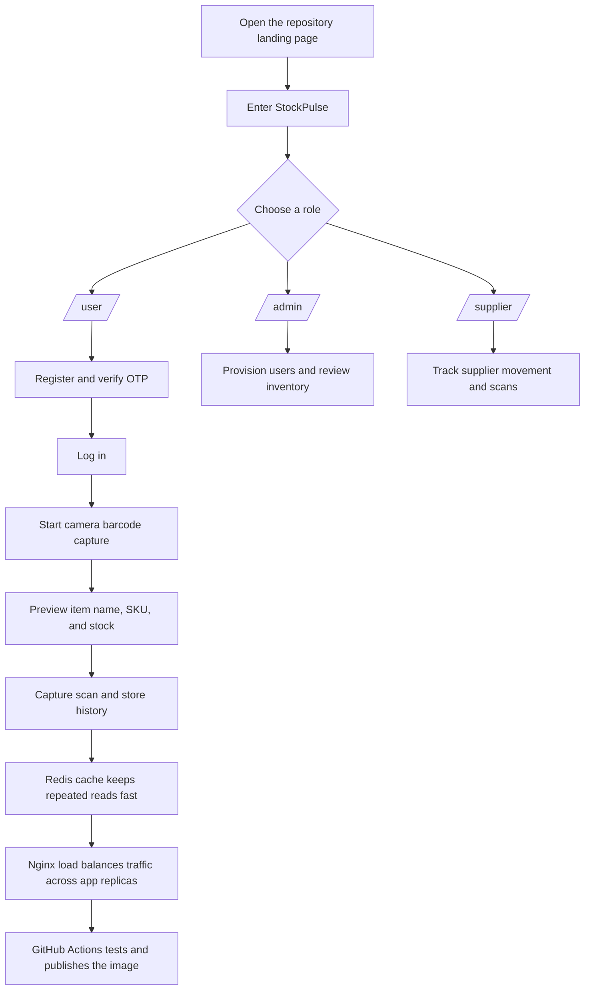

# StockPulse on GitHub

[](https://github.com/osman-builds/Hugging-Face--Projects/actions/workflows/ci-cd.yml)

StockPulse is the main application in this repository. It is a FastAPI inventory and barcode-scanning system with role-based portals, PostgreSQL, Redis caching, Docker, and GitHub Actions for automated test and image publishing.

## Why This Repo Exists

Retail and warehouse teams need a system that can:

- identify items quickly from a barcode or SKU,
- show the item name and stock status immediately,
- stay responsive when traffic increases,
- keep running even if one app instance fails,
- and publish a container image automatically after passing tests.

This repository was built to solve those problems in a way that is easy to run locally and easy to deploy from GitHub.

## How The System Works



## What Is In The Repository

### Main App

The production-facing application lives in [Project 1](Project%201/).

Important parts:

- [Project 1/app.py](Project%201/app.py) for the FastAPI app and UI pages.
- [Project 1/docker-compose.yml](Project%201/docker-compose.yml) for the multi-service deployment stack.
- [Project 1/nginx.conf](Project%201/nginx.conf) for the load balancer.
- [.github/workflows/ci-cd.yml](.github/workflows/ci-cd.yml) for the active GitHub Actions pipeline.
- [Project 1/README.md](Project%201/README.md) for the app-level setup and feature guide.

### Tutorials

The [tutorials](tutorials/) folder contains the lightweight demo scripts that were included with the repo.

## Active GitHub Actions Workflow

The workflow at [.github/workflows/ci-cd.yml](.github/workflows/ci-cd.yml) is active on the `main` branch and does two things:

- runs the test suite on pull requests and pushes,
- builds and pushes the Docker image to GitHub Container Registry on `main`.

## Quick Start

If you want to run the main app locally:

```bash
cd "Project 1"
docker compose up --build
```

Then open the app at [http://localhost:8000](http://localhost:8000).

## Repository Layout

- `Project 1/` - main StockPulse app, Docker, tests, and GitHub Actions.
- `tutorials/` - small sample scripts and supporting files.

## Next Step

If you want the repo landing page to show even more, the next useful upgrade is to add deployment status badges and a short screenshot section for the UI.
