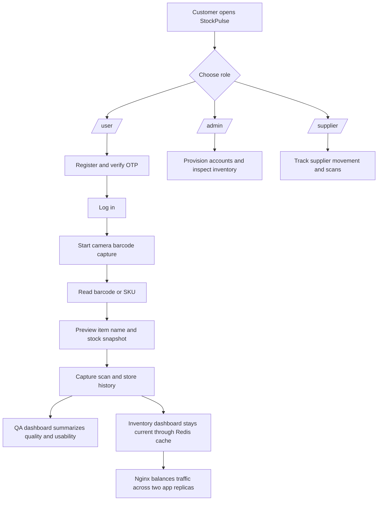

# StockPulse

StockPulse is a FastAPI inventory and scan-tracking app built to solve a practical operations problem: teams need a fast way to identify products, capture barcode scans from a camera, and keep stock visibility high even when traffic increases or one backend instance fails.

## Customer Problem

The original prototype was a single app process with direct reads from the database. That creates three practical issues:

- Inventory and barcode lookups become slower as usage grows.
- A single server instance becomes a single point of failure.
- The user flow is hard to explain because the app, deployment, and scan workflow were not documented together.

## What We Implemented And Why

- A modern role-based UI because users need a clear path into the right portal without hunting through menus.
- Camera barcode capture because typing item codes by hand is slow and error-prone in warehouse and retail workflows.
- Redis caching because repeated inventory and preview reads should not hit the database every time.
- An Nginx load balancer because traffic should be spread across two app replicas instead of depending on one container.
- GitHub Actions because the same build and test flow should run automatically before the Docker image is published.

## Visual Tour

| Page | Purpose | QA / UX Signal |
| --- | --- | --- |
| Landing page | Role entry point | Clear navigation into user, admin, supplier, and QA views |
| User portal | Registration and scan flow | Confirms OTP, login, and scan capture are usable |
| Admin portal | Provisioning and inventory control | Keeps management actions isolated from public users |
| Supplier dashboard | Supplier movement visibility | Checks that role boundaries are enforced |
| QA dashboard | Product quality and usability review | Gives a quick release-quality snapshot |

## How The System Works



## Visual Summary

| Part | Why It Exists | How It Helps |
| --- | --- | --- |
| Landing page | Reduce user confusion | Shows the right portal for each role |
| Camera barcode capture | Remove manual typing | Reads item codes from the camera and previews item info |
| Redis cache | Reduce database load | Speeds up repeated inventory and preview reads |
| Nginx load balancer | Increase uptime | Routes traffic to healthy app replicas |
| GitHub Actions | Automate delivery | Tests and builds the Docker image on every push/PR |

## Scan Flow

1. Open the user portal and log in.
2. Start the camera scanner.
3. Point the camera at the barcode.
4. StockPulse resolves the item code to the item record and shows the name, SKU, category, safety stock, and remaining quantity.
5. Confirm the scan to save the event and update the history panel.

## Quick Start

Install dependencies:
```
pip install -r requirements.txt
```

For local runs without Docker, set `STOCKPULSE_DATABASE_URL` to a reachable PostgreSQL instance. A sample `.env.example` is included for convenience.

Run the API:
```
uvicorn main:app --reload
```

Run tests:
```
python -m unittest discover -s tests -t .
```

## Docker And Uptime

Build and run the full stack:
```
docker compose up --build
```

Compose now starts:

- two StockPulse app replicas,
- Redis for cache reads,
- PostgreSQL for persistence,
- Nginx as the front door load balancer.

The API is exposed on http://localhost:8000 through Nginx. If one app replica fails, the other can continue serving traffic.

Run the image directly without Compose:
```
docker build -t stockpulse:local .
docker run -p 8000:8000 stockpulse:local
```

The standalone image still uses a local SQLite fallback so the web app starts even when PostgreSQL is not present. Compose overrides the database and Redis URLs for the production-like path.

## GitHub Actions

The workflow in [.github/workflows/ci-cd.yml](.github/workflows/ci-cd.yml) does two things:

- Runs the test suite on pull requests and pushes to `main`.
- Builds and pushes the Docker image to GitHub Container Registry on `main`.

The build job also writes the published image reference into the GitHub Actions job summary so you can copy the GHCR path quickly after a run.

## Icon

The app icon lives at [static/stockpulse-icon.svg](static/stockpulse-icon.svg) and is used as the favicon across the HTML pages.

JWT auth:
- `POST /auth/register` with `username`, `email`, and `password` to create a pending account and send an OTP to a real deliverable email address.
- `POST /auth/verify-otp` with `email` and `otp_code` to verify the account and receive a bearer token.
- `POST /auth/token` with `identifier` and `password` to sign in after verification.
- Use `Authorization: Bearer <token>` on `POST /suppliers`, `POST /products`, `POST /batches`, and `POST /sales`.
- Sessions are server-tracked with an idle timeout to reduce token hijacking risk.
- Public sign-up only creates standard user accounts; admin and supplier accounts are provisioned server-side.

Browser pages:
- `/user` for account registration, OTP verification, user access, and camera barcode capture.
- `/admin` for admin registration, user listing, and admin access.
- `/supplier` for supplier-specific stock movement and replenishment visibility.
- `/qa` for quality, metric, and usability review.
- All portals include a scan-capture form and scan history panel backed by persisted scan events.

Email and admin setup:
- Set `STOCKPULSE_SMTP_HOST`, `STOCKPULSE_SMTP_PORT`, `STOCKPULSE_SMTP_USERNAME`, `STOCKPULSE_SMTP_PASSWORD`, and `STOCKPULSE_SMTP_FROM` to enable OTP email delivery.
- Set `STOCKPULSE_ADMIN_CODE` to control who can register as admin.
- Set `STOCKPULSE_SUPPLIER_CODE` if you want to gate supplier account provisioning separately.

What's included:
- `main.py` — Uvicorn entrypoint for the app.
- `app.py` — FastAPI endpoints for suppliers, products, batches, sales (FEFO deduction), scan capture, inventory summaries, dashboard UI, and ROP calculation.
- `presentation.py` — Jinja rendering helpers for the HTML views.
- `templates/` — StockPulse page templates, including the QA dashboard.
- `models.py` / `db.py` — SQLAlchemy models and DB initialization.
- `rop.py` — Velocity and ROP calculations.
- `tests/` — unit tests for the ROP math, inventory helpers, and dashboard render.
- `static/stockpulse-icon.svg` — reusable app icon and favicon.

Next steps:
- Add authentication and pagination.
- Add background worker to compute velocities and emit alerts (Celery/Redis).
